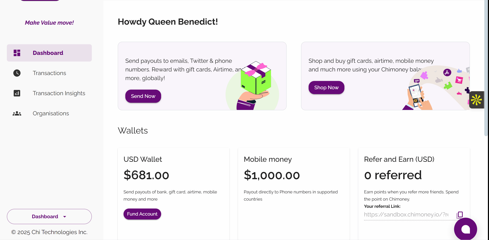

# Setup Guide: Multi-Currency Wallet Transfers with Chimoney API

This guide will walk you through the essential steps to prepare your environment and obtain the necessary credentials before you begin integrating with Chimoney's Multi-Currency Wallet Transfer API.

## 1. Prerequisites

Before you start coding, ensure you have the following set up:

- **A Chimoney developer account**: This is required to access the developer portal and manage your applications. To get access sign up at [sandbox.chimoney.io](https://sandbox.chimoney.io).
- **A new application on Your Chimoney developer dashboard**: This is crucial for generating and accessing your unique API key.  
- **Node.js Installed**: We recommend the latest LTS version for running the JavaScript code samples. You can download it from [nodejs.org](https://nodejs.org).  
- **An IDE**: We recommend a code editor like VsCode to write and manage your code.


## 2. Setup the development environment

You'll need a tool to make your HTTP requests in JavaScript. In this guide we are using `axios` a popular, a HTTP client that simplifies making API calls from both Node.js and the browser. However, you can use any other HTTP client you are more comfortable with, such as the browser's `fetch` API.

To install Axios, open your terminal, navigate to your project directory, and run the following command:
 
  ```bash
  npm install axios
```

## 3. Get your Chimoney API key

Your API key authenticates requests and links them to your Chimoney account, serving as a security token.You must include it with every API call you make. To get it, navigate to the [Chimoney developer portal](https://sandbox.chimoney.io/). From your developer dashboard, create a new application, and then generate your API key. Copy the key after it's generated. 



## 4.  Authenticate API requests
To authenticate your API calls, you need to include your API key in the request headers. Here is a basic setup for your request headers in JavaScript. Remember to replace `YOUR_API_KEY` with the actual key you copied.

```javascript
const headers = {
  'Content-Type': 'application/json',
  'Accept': 'application/json',
  'X-API-KEY': 'YOUR_API_KEY' // Replace 'YOUR_API_KEY' with your actual key
};
```

## 5. Make your first API call
Now that you've set up your environment and secured your API key, it's time to make an API request. This step will confirm your setup is working correctly by initiating a multi-currency wallet transfer.

The core of this request is the `transferDetails` object. This object holds all the information the API needs to process the transfer: the amount to send, the origin and destination currencies, and the recipient's email address.

Below is a complete code example for making this request. Copy this into a new JavaScript file, the name of the file is totally up to you, (e.g `transfer.js`), and replace the placeholders with your actual API key and a test email address.

Once you've saved the file, open your terminal, navigate to your project directory, and run the following command. `node server [JavaScript filename]` e.g `node server transfer.js`.

```javascript
const axios = require('axios');

// Request body -- the transfer details

const transferDetials = {
    amountToSend: '50',
  originCurrency: 'USD',
  destinationCurrency: 'USD',
  email: 'queendolineak@gmail.com' //Insert a test email address here
}
// API key and headers
const headers = {
  'Content-Type': 'application/json',
  'Accept': 'application/json',
  'X-API-KEY': 'YOUR API KEY' 
};

// POST request 
axios.post(
  'https://api-v2-sandbox.chimoney.io/v0.2.4/multicurrency-wallets/transfer',
  transferDetails,
  { headers }
)
.then(response => {
  console.log('Transfer successful:', response.data);
})
.catch(error => {
  console.error('Transfer failed:', error.response?.data || error.message);
});
```
Upon a successful request, you should see a response in your terminal similar to the one below. This confirms that your setup is accurate and you can now communicate with the Chimoney API.

```json
{
  "status": "success",
  "message": "Payout to Chimoney wallets completed successfully.",
  "data": {
    "paymentLink": "https://sandbox.chimoney.io/pay/?issueID=...",
    "chimoneys": [
      {
        "id": "6jLD9Ynyd6qGLV4zHL9U",
        "valueInUSD": "10",
        "email": "queendolineak@gmail.com",
        "destinationCurrency": "NGN",
        "redeemLink": "https://sandbox.chimoney.io/redeem/?chi=..."
      }
    ]
  }
}
```

With these steps completed, your environment is ready for more complex integrations and applications. The successful API call confirms your setup is correct and you can now begin exploring other Chimoney services."

To learn more about the API's full capabilities and to get detailed information on multicurrency wallet transfers and other services, visit the Visit the official [Chimoney reference documentation](https://chimoney.readme.io/reference/post_v0-2-4-multicurrency-wallets-create).